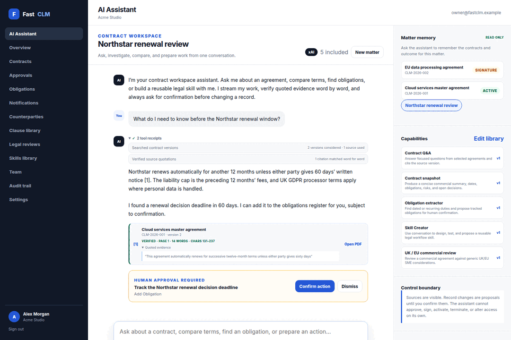

# FastCLM

[](https://clm.fastsme.com)

FastCLM is an open-source contract lifecycle management workspace for small and
mid-sized organisations. It keeps contracts, counterparties, immutable
versions, clause knowledge, approval decisions, obligations, renewals, and an
append-only audit trail in one focused system.



[AI assistant](screenshots/02-ai-assistant.png) ·
[grounded PDF source](screenshots/03-pdf-source.png) ·
[skills library](screenshots/04-skills-library.png) ·
[skill editor](screenshots/05-skill-editor.png) ·
[contract record](screenshots/08-contract-record.png)

The default installation needs no external services. It runs on FastHTML with
SQLite, local authentication, deterministic synthetic demonstration data, and
a conservative contract review that works without an AI key. Google OpenID
Connect and a token-gated integration API are optional.

## Implemented product surface

- Organisation-isolated workspaces with owner, administrator, legal,
  approver, and member roles.
- Assistant-first contract workspace with persistent conversations, streamed
  xAI tokens, live tool activity, and durable tool receipts.
- Organisation-scoped retrieval with exact source versions and word-level
  quote verification. Unsupported quotes are visibly marked unverified.
- Confirmation-gated action proposals: the assistant can prepare work but
  cannot silently approve, sign, activate, terminate, or change access.
- Transparent organisation skill library with editable Markdown instructions,
  five starter workflows, immutable version history, and a conversational
  Skill Creator that drafts a reviewable skill proposal.
- Source-aware PDF.js side pane that opens the uploaded original and searches
  for the assistant's exact quoted evidence without leaving the conversation.
- Contract register with search, status filters, counterparties, commercial
  value, dates, ownership, renewal terms, and risk level.
- Reviewed lifecycle transitions from draft through review, approval,
  signature, active, expiry, or termination.
- Immutable text/file version history with SHA-256 integrity checks.
- Approval decisions, due and overdue obligations, clause library, renewal and
  notice-window tracking, and append-only activity history.
- Deterministic risk review that surfaces common commercial terms without
  making legal decisions or changing contract state.
- Google OIDC with state validation and verified-email allowlists.
- Authenticated, organisation-scoped FastAPI routes with paginated reads,
  an audited obligation write, generated OpenAPI docs, and a committed schema.
- Responsive public landing page and workspace, health/SEO endpoints, Docker,
  and Coolify-ready configuration for `clm.fastsme.com`.

## Run locally

Python 3.13 is recommended.

```bash
python3.13 -m venv .venv
.venv/bin/python -m pip install -e '.[dev]'
cp .env.sample .env
.venv/bin/python seed.py
.venv/bin/python web_app.py
```

Open `http://localhost:5025`. The sample configuration enables `/auth/test`,
which opens the synthetic Acme Studio workspace without a committed password.
Disable that route in production.

## Verification

```bash
.venv/bin/python -m pytest
.venv/bin/ruff check .
.venv/bin/python -m compileall -q fastclm web_app.py seed.py
```

## Routes

- Public landing: `/`
- AI assistant workspace: `/app`
- Operational overview: `/overview`
- Contract register: `/contracts`
- Obligations: `/obligations`
- Counterparties: `/counterparties`
- Clause library: `/clauses`
- Skills library: `/skills`
- Audit trail: `/audit`
- Developer guide: `/developers`
- API discovery: `/api/`
- API documentation: `/api/docs`
- Runtime OpenAPI: `/api/openapi.json`
- Stable OpenAPI snapshot: `/swagger.json`
- Health: `/healthz`

## Deployment

The container listens on port `5025`, stores runtime data under `/data`, and
publishes a health check at `/healthz`. See [DEPLOY.md](DEPLOY.md) for the
Coolify variables and DNS/TLS checklist.

## Product walkthrough

The walkthrough is generated only from the synthetic Acme Studio workspace.
It intentionally contains no production agreements or saved browser profile.

```bash
.venv/bin/python scripts/capture_demo.py
scripts/build_demo_gif.sh
```

The capture script validates browser console output and writes its ordered
frame list to `screenshots/manifest.txt`. The GIF builder refuses missing
frames and publishes identical copies for this README and the landing page.

## Security

Contract content is private. API data routes are disabled until
`FASTCLM_API_TOKEN` is configured and then require both a bearer token and an
explicit organisation header. API writes also require an authorised member ID
for permission checks and audit attribution. Uploaded files are stored outside
the source tree and served only after session, tenant, and original-file
checksum checks. Review findings are assistive signals, not legal advice.
PDF sources use the same checks before inline viewing. Skill instructions,
assistant messages, and tool receipts are workspace-scoped. Citation
verification checks whether the quoted words occur consecutively in the cited
immutable version; it does not prove the model's interpretation. Assistant
answers are assistive signals, not legal advice.

FastCLM ships with synthetic data only. Do not load production agreements into
an unreviewed demo deployment.

## Licence

MIT. See [LICENSE](LICENSE). FastCLM is part of the open-source
[FastSME](https://fastsme.com) suite.
